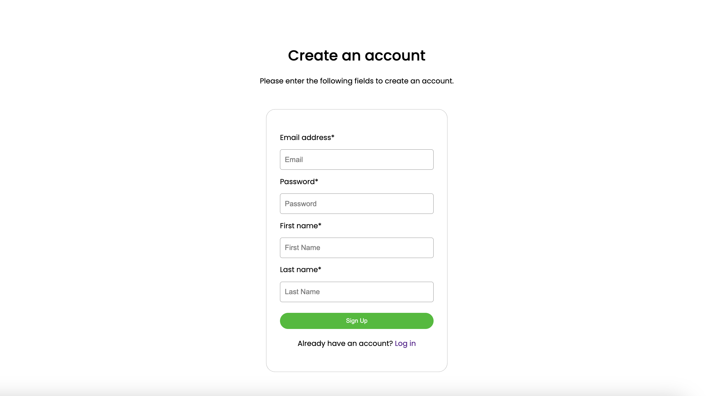
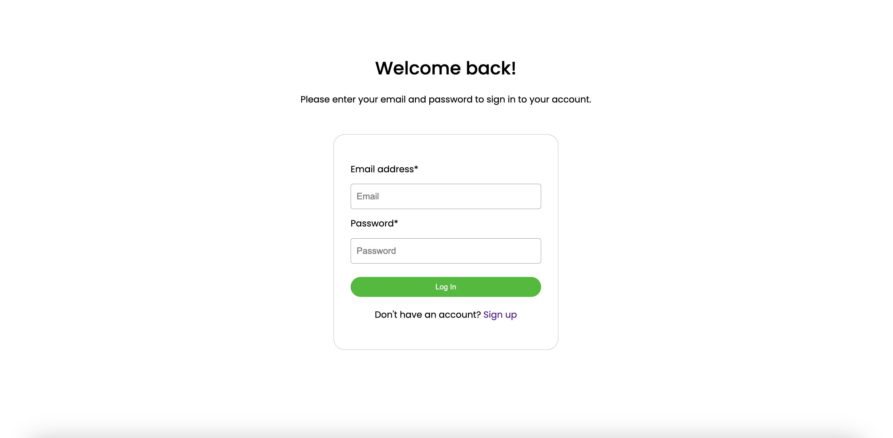
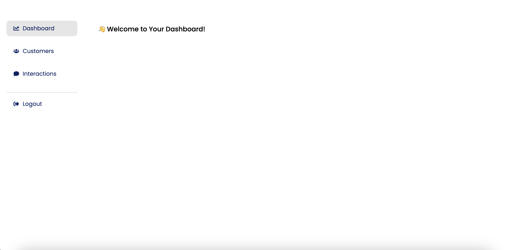
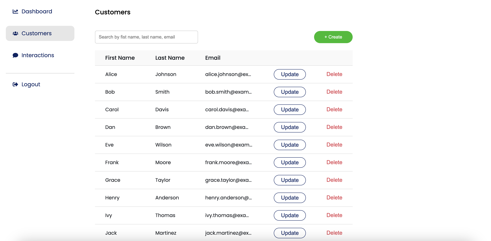
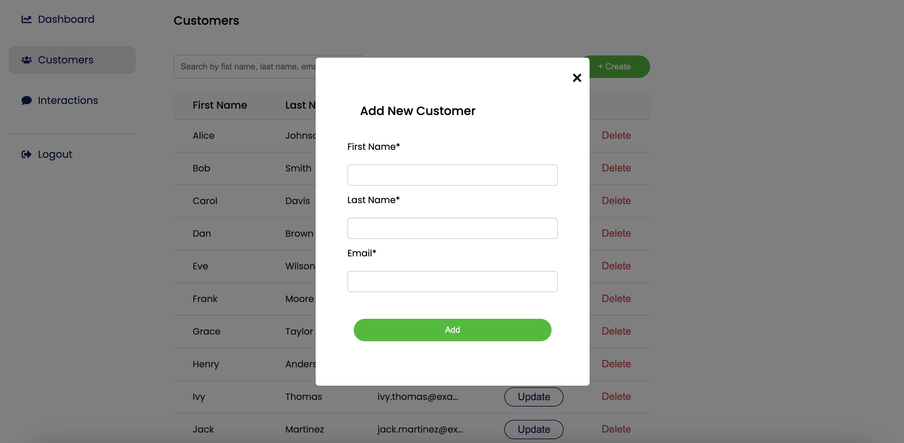
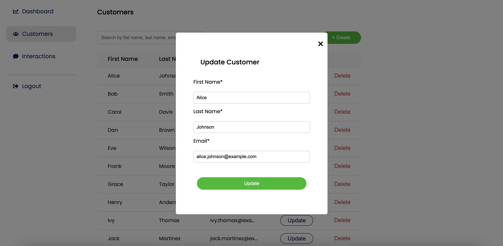
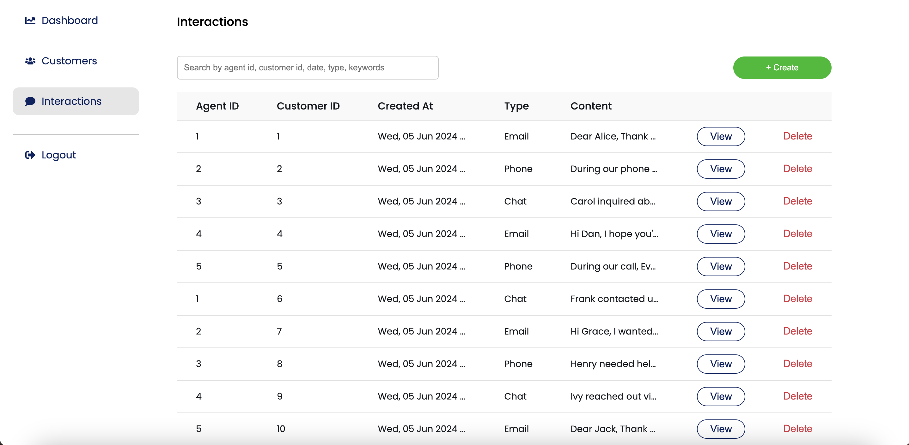
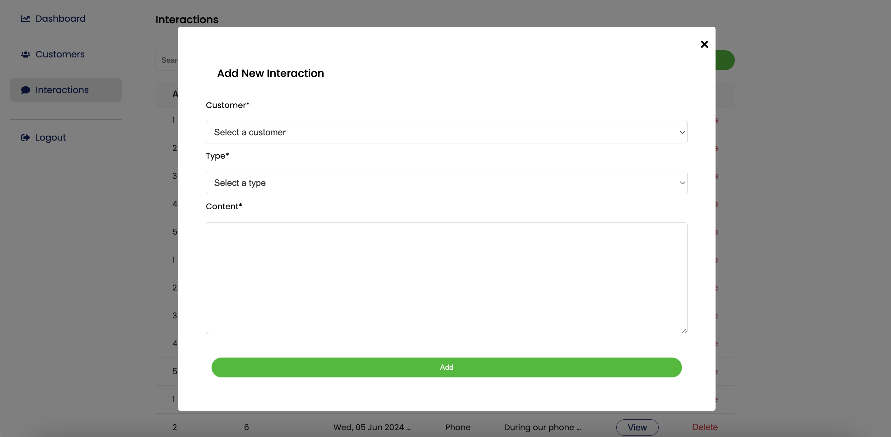
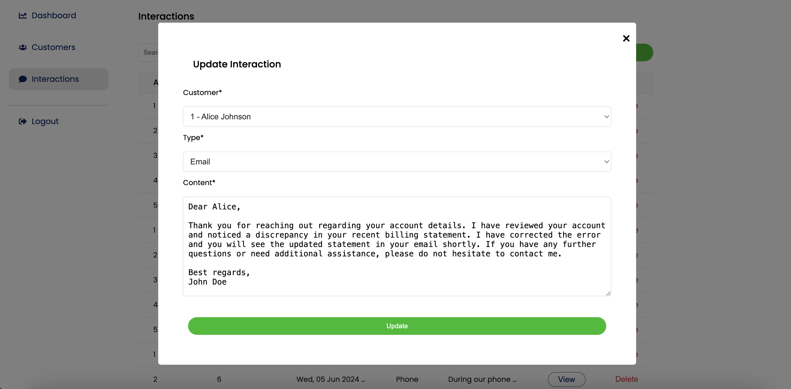

# Customer Interaction Management System


## Overview

When an agent signs up, their information is stored in the agents database. After signing up, the agent is directed to a dashboard where they can view a list of clients and interactions.

On the dashboard, agents have the ability to manage both clients and interactions. When an agent adds a new interaction, their ID is automatically associated with that interaction.

Once the agent is done working, they can log out until the next time they need to use the system.

## Table of Contents

- [Backend](#backend)
  - [Requirements](#requirements)
  - [Installation](#installation)
  - [Usage](#usage)
- [Frontend](#frontend)
  - [Requirements](#requirements-1)
  - [Installation](#installation-1)
  - [Usage](#usage-1)
- [Authentication](#authentication)
- [Database](#database)
- [Screenshots](#screenshots)
- [Demo Videos](#demo-videos)
- [License](#license)

## Backend

### Requirements

- Python 3.x
- Flask
- PostgreSQL
- SQLAlchemy

### Installation

1. **Clone the repository:**

    ```bash
    git clone https://github.com/mleonova/customer-service-app.git
    cd customer-service-app/backend
    ```

2. **Install the required packages:**

    ```bash
    pip install -r requirements.txt
    ```

3. **Seed the database:**

    ```bash
    flask seed-db
    ```

4. **Start the Flask server:**

    ```bash
    flask run
    ```

### Usage

The backend server will be running at `http://localhost:5000/`.

## Frontend

### Requirements

- Node.js
- React
- npm or yarn

### Installation

1. **Navigate to the frontend directory:**

    ```bash
    cd ../frontend
    ```

2. **Install dependencies:**

    ```bash
    npm install
    ```

3. **Start the frontend server:**

    ```bash
    npm start
    ```

### Usage

The frontend development server will be running at `http://localhost:3000/`.

## Authentication

Authentication is implemented using JWT (JSON Web Tokens). When a user logs in, a JWT token is generated and stored in the local storage. This token is used to authenticate API requests.

## Database

The project uses PostgreSQL as the database. SQLAlchemy is used for database interactions. 

### Database Schema

#### Agent Table

| Field       | Description                      |
|-------------|----------------------------------|
| Agent ID    | Unique identifier for each agent |
| Email       | Email address of the agent       |
| Password    | Encrypted password for authentication |
| First Name  | First name of the agent          |
| Last Name   | Last name of the agent           |

#### Customer Table

| Field           | Description                              |
|-----------------|------------------------------------------|
| Customer ID     | Unique identifier for each customer      |
| First Name      | First name of the customer               |
| Last Name       | Last name of the customer                |
| Email           | Email address of the customer            |

#### Interaction Table

| Field           | Description                              |
|-----------------|------------------------------------------|
| Interaction ID  | Unique identifier for each interaction  |
| Agent ID        | ID of the agent who performed the interaction |
| Customer ID     | ID of the customer involved in the interaction |
| Interaction Type | Type of interaction (phone call, email, chat, etc.) |
| Content         | Details or content of the interaction   |
| Timestamp       | Date and time when the interaction occurred |

## Screenshots

### Signup Page


### Login Page


### Dashboard


### Customers Tab


### Add Customer


### Update Customer


### Interactions Tab


### Add Interaction


### Update Interaction



## Demo Videos

You can view the demo videos below:

- [Demo 1](demo/signup.mov)
- [Demo 2](demo/login.mov)
- [Demo 3](demo/customers.mov)
- [Demo 4](demo/customers2.mov)
- [Demo 5](demo/interactions.mov)

## License

This project is licensed under the MIT License. See the [LICENSE](LICENSE) file for details.
